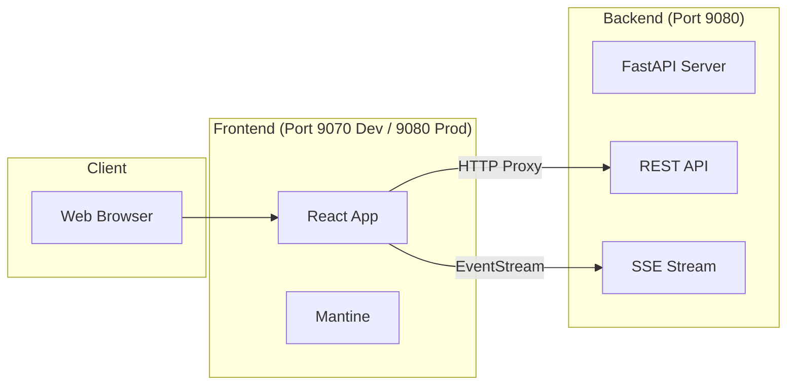
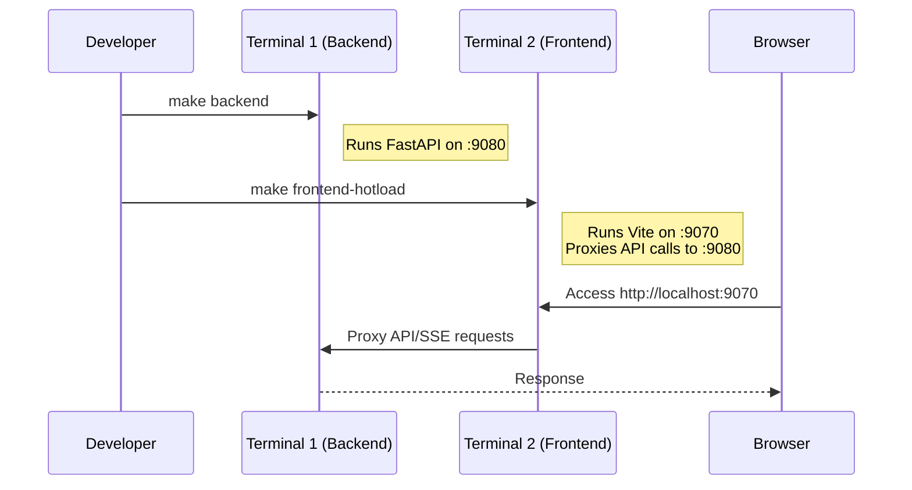
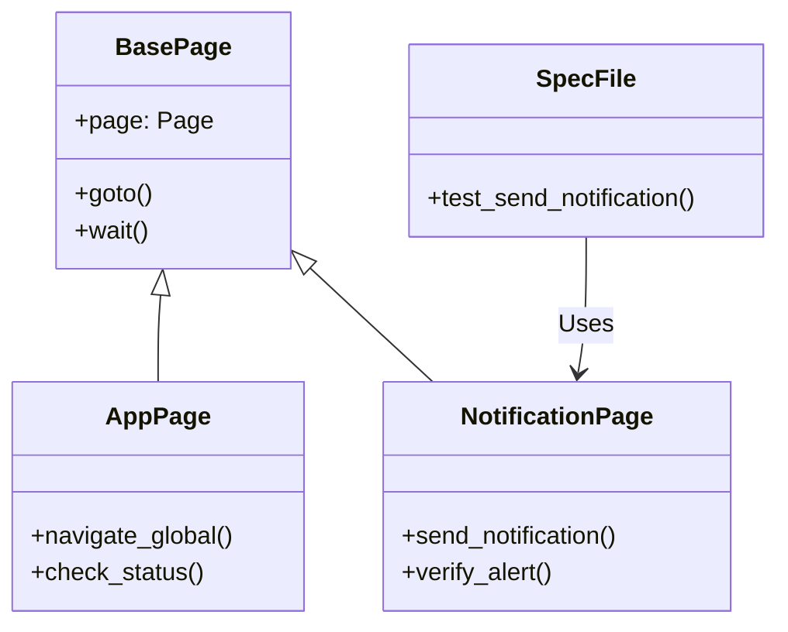

# NotifyHub

> **Summary**: NotifyHub is a single-page notification app for developers, combining Python FastAPI backend with React frontend. Uses Server-Sent Events for real-time alerts and includes audio notifications with autoplay. Features CLI integration, Mantine UI, and Playwright testing. Supports hot-reload development and production static serving.

- [NotifyHub](#notifyhub)
  - [1. System Overview \& Tech Stack](#1-system-overview--tech-stack)
    - [Architecture Diagram](#architecture-diagram)
    - [Technology Stack](#technology-stack)
    - [Project Structure](#project-structure)
  - [2. Installation \& Setup](#2-installation--setup)
    - [Prerequisites](#prerequisites)
    - [Initial Install](#initial-install)
    - [OpenCode Plugin Installation (Optional)](#opencode-plugin-installation-optional)
  - [3. Backend Configuration](#3-backend-configuration)
    - [Command-Line Options](#command-line-options)
    - [Configuration File](#configuration-file)
  - [4. Frontend Loading Modes](#4-frontend-loading-modes)
    - [Hot-reload Diagram](#hot-reload-diagram)
    - [Why the Proxy is Needed](#why-the-proxy-is-needed)
    - [Commands](#commands)
  - [5. Production Usage](#5-production-usage)
  - [7. CLI Usage](#7-cli-usage)
    - [Python CLI (cli.py)](#python-cli-clipy)
    - [Shell Script CLI (notifyhub-push.sh)](#shell-script-cli-notifyhub-pushsh)
  - [6. Testing Strategy](#6-testing-strategy)
    - [Test Architecture (Page Object Model)](#test-architecture-page-object-model)
    - [6.1 UI Test Setup](#61-ui-test-setup)
    - [6.2 Running Tests](#62-running-tests)
    - [6.3 Test Organization](#63-test-organization)
      - [Notification Test Strategy](#notification-test-strategy)
    - [6.4 Chrome Remote Debugging (CDP)](#64-chrome-remote-debugging-cdp)

## 1. System Overview & Tech Stack

NotifyHub is a single-page application consisting of a Python FastAPI backend and a React frontend. The application uses Server-Sent Events (SSE) for real-time updates and features audio notifications with autoplay handling.

### Architecture Diagram



### Technology Stack

| Layer        | Technology              | Role                                  |
| ------------ | ----------------------- | ------------------------------------- |
| **Backend**  | **Python + FastAPI**    | Server, REST API, Static File Serving |
| **Frontend** | **React**               | UI                                    |
| **Styling**  | **Mantine**             | UI Components & Styling               |
| **Build**    | **Bun + Vite**          | Package Management & Bundling         |
| **Testing**  | **pytest + Playwright** | Backend Unit Tests & E2E UI Tests     |

### Project Structure

The repository includes a `__refmodules__/` directory containing cloned third-party libraries. These are **not directly imported** into the NotifyHub codebase but serve as reference materials for development and integration purposes. Having the complete source code of libraries like Pharos allows for:

- Better understanding of component internals
- Easier debugging of integration issues
- Reference for customization possibilities
- Offline access to documentation and examples

**Note:** Files in `__refmodules__/` should not be modified as they are external dependencies.

---

## 2. Installation & Setup

### Prerequisites

- Python 3.x
- Bun (JavaScript runtime/package manager)
- VSCode Extensions:
  - [CSS Navigation](https://marketplace.visualstudio.com/items?itemName=pucelle.vscode-css-navigation) - Enables Ctrl+click navigation for CSS imports and variable definitions

### Initial Install

Run the following to set up both backend and frontend dependencies:

```bash
# Install backend dependencies (editable mode)
pip install -e .

# Install frontend dependencies (includes testing tools)
make frontend-deps

# (Optional) Build web assets immediately
make frontend

```

### OpenCode Plugin Installation (Optional)

To integrate NotifyHub with OpenCode, you can install the NotifyHub plugin:

```bash
# Install the plugin
make install-plugin

# Remove the plugin (if needed)
make remove-plugin
```

This copies the plugin file from `src/notifyhub/plugins/opencode/notifyhub-plugin.ts` to `~/.config/opencode/plugin/` and enables NotifyHub notifications in OpenCode.

---

## 3. Backend Configuration

NotifyHub backend supports configuration via command-line arguments and a TOML config file for flexible deployment options.

### Command-Line Options

The backend accepts the following CLI arguments:

```bash
python -m notifyhub.backend.backend [options]
```

| Option                      | Default   | Description                                                   |
| --------------------------- | --------- | ------------------------------------------------------------- |
| `--port`                    | 9080      | Port to run the server on                                     |
| `--host`                    | "0.0.0.0" | Host to bind the server to                                    |
| `--sse-heartbeat-interval`  | 30        | SSE heartbeat interval in seconds                             |
| `--notifications-max-count` | None      | Maximum number of notifications to store (None for unlimited) |

**Examples:**

```bash
# Run with custom port and host
python -m notifyhub.backend.backend --port 8080 --host 127.0.0.1

# Limit notifications to 100 and faster heartbeat
python -m notifyhub.backend.backend --notifications-max-count 100 --sse-heartbeat-interval 15
```

### Configuration File

For persistent configuration, create a TOML file at `~/.config/notifyhub/config.toml`:

```toml
# This config overrides CLI defaults
[backend]
port = 9080
host = "0.0.0.0"
sse_heartbeat_interval = 30
# notifications_max_count = 1000  # Leave unset for unlimited
```

**Configuration Hierarchy:**
1. Hardcoded defaults
2. Config file values (if file exists)
3. CLI arguments (highest priority)

**Example config location:**
- macOS/Linux: `~/.config/notifyhub/config.toml`
- Copy from: `src/notifyhub/example_config.toml`

---

## 4. Frontend Loading Modes

For hot-reloading, run the backend and frontend in separate terminals.

### Hot-reload Diagram



### Why the Proxy is Needed

In hot-reload mode, frontend runs on port 9070 and backend on port 9080. Since browsers block requests between different ports (CORS), the Vite dev server acts as a proxy—intercepting API calls from the browser, forwarding them to the backend on port 9080, and returning the response. The browser only sees port 9070, avoiding CORS issues.

**Setup:**

| Mode       | Frontend | Backend | Proxy Needed?        |
| ---------- | -------- | ------- | -------------------- |
| Hot-reload | `:9070`  | `:9080` | Yes                  |
| Static     | `:9080`  | `:9080` | No (served together) |

**Hot-reload flow:**

```
Browser → Frontend (:9070) → Proxy → Backend (:9080)
```

**Benefits:**

- No CORS configuration needed on backend
- Frontend hot-reloading enabled
- Clean separation of concerns

### Commands

**Terminal 1: Start Backend**

```bash
make backend
# Serves on http://localhost:9080

```

**Terminal 2: Start Frontend (Hot-Reload)**

```bash
make frontend-hotload
# Serves on http://localhost:9070 (Proxies to backend)

```

> **Note:** Access the UI at **`http://localhost:9070`** for hot-reloading.

---

## 5. Production Usage

To run the application as it would appear in production (serving built static assets via FastAPI):

1. **Build Assets:**

```bash
make frontend
# Builds React app to src/notifyhub/frontend/static/

```

2. **Start Server:**

```bash
make backend
# FastAPI serves static files from static/ at:
# - /static/* (general assets like JS/CSS)
# - /icons/* (icon files)
# - /audio/* (audio files)
# Note: When adding new asset folders to static/, update backend.py mounts accordingly.

```

3. **Access:**
   Open **`http://localhost:9080`**. (Default: Dark Theme).
4. **Send Test Notification (CLI):**

```bash
make noti

```

---

## 7. CLI Usage

NotifyHub provides two CLI options for sending notifications:

### Python CLI (cli.py)
For full-featured notification sending with client-side validation:
```bash
python src/notifyhub/cli.py --port 9080 '{"message": "Hello World"}'
```

### Shell Script CLI (notifyhub-push.sh)
For lightweight notification sending without Python dependencies. Always constructs a notification with the current directory (PWD) and the provided message:

```bash
./src/notifyhub/notifyhub-push.sh "Task completed"
# Sends: {"pwd": "/current/directory", "message": "Task completed"}
```

Environment variables:
- `NOTIFYHUB_ADDRESS`: Full server URL (default: http://localhost:9080)
- `PWD`: Current directory (automatically set by shell)

Examples:
```bash
# Simple message
./src/notifyhub/notifyhub-push.sh "Build finished"

# Multi-word message
./src/notifyhub/notifyhub-push.sh "Long running task" completed

# Custom address
export NOTIFYHUB_ADDRESS=http://myhost.com:8080
./src/notifyhub/notifyhub-push.sh "Hello from shell!"
```

---

## 6. Testing Strategy

NotifyHub uses a combination of `pytest` for the backend and `Playwright` for frontend UI testing.

### Test Architecture (Page Object Model)



### 6.1 UI Test Setup

Before running UI tests, ensure Playwright browsers are installed:

```bash
# Install dependencies
cd src/notifyhub/frontend && bun install

# Install Playwright browsers
npx playwright install

```

### 6.2 Running Tests

You can run tests via standard NPM commands or the provided Makefile shortcuts.

| Scope            | Command                      | Description                                     |
| ---------------- | ---------------------------- | ----------------------------------------------- |
| **Backend**      | `make test-backend`          | Run pytest (backend only)                       |
| **UI (Prod)**    | `make test-frontend`         | Run Playwright tests against port 9080 (headed) |
| **UI (Hotload)** | `make test-frontend-hotload` | Run Playwright tests against port 9070 (headed) |
| **Connection**   | `make test-chrome`           | Test Chrome CDP connection utility              |
| **All**          | `make test-all`              | Run entire test suite                           |

### 6.3 Test Organization

The project follows the Page Object Model (POM) design pattern:

```text
src/notifyhub/frontend/__tests__/ui/
├── pages/                  # Page Object Model classes
│   ├── AppPage.ts          # App-wide interactions
│   ├── BasePage.ts         # Base class with common methods
│   └── NotificationPage.ts # Notification-specific actions
├── specs/                  # Test specifications
│   └── notification.spec.ts
├── utils/                  # Helper utilities
│   └── test_chrome_connection.ts
└── tsconfig.json           # TypeScript configuration

src/notifyhub/backend/__tests__/
├── test_cli.py             # CLI tests
├── test_models.py          # Model tests
└── test_server.py         # Server tests

```

#### Notification Test Strategy

The `notification.spec.ts` test suite implements a backup-and-restore approach for testing. See the detailed documentation in the test file itself (`src/notifyhub/frontend/__tests__/ui/specs/notification.spec.ts`) for the complete strategy.

### 6.4 Chrome Remote Debugging (CDP)

Tests can connect to an existing Chrome instance via the Chrome DevTools Protocol (CDP). This requires launching Chrome with specific flags.

**macOS:**

```bash
/Applications/Google\ Chrome.app/Contents/MacOS/Google\ Chrome --remote-debugging-port=9222 --remote-debugging-address=0.0.0.0 --user-data-dir=/tmp/chrome-debug
```

**Linux:**

```bash
google-chrome --remote-debugging-port=9222 --remote-debugging-address=0.0.0.0 --user-data-dir=/tmp/chrome-debug
```
