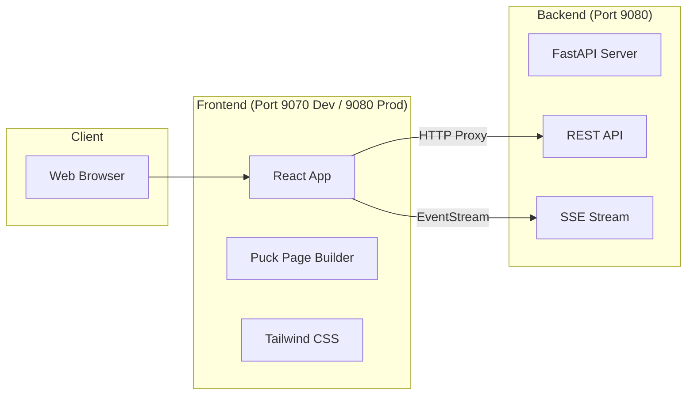
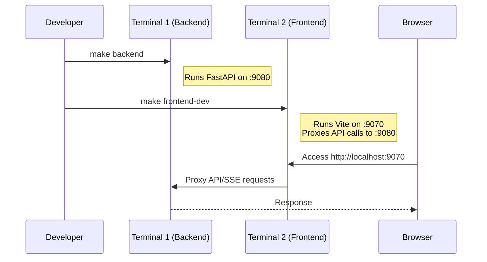
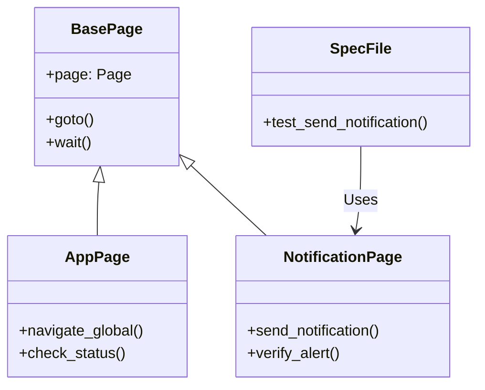

# NotifyHub

- [NotifyHub](#notifyhub)
  - [1. System Overview \& Tech Stack](#1-system-overview--tech-stack)
    - [Architecture Diagram](#architecture-diagram)
    - [Technology Stack](#technology-stack)
  - [2. Installation \& Setup](#2-installation--setup)
    - [Prerequisites](#prerequisites)
    - [Initial Install](#initial-install)
    - [OpenCode Plugin Installation (Optional)](#opencode-plugin-installation-optional)
  - [3. Development Workflow](#3-development-workflow)
    - [Development Diagram](#development-diagram)
    - [Why the Proxy is Needed](#why-the-proxy-is-needed)
    - [Commands](#commands)
  - [4. Production Usage](#4-production-usage)
  - [5. Testing Strategy](#5-testing-strategy)
    - [Test Architecture (Page Object Model)](#test-architecture-page-object-model)
    - [5.1 UI Test Setup](#51-ui-test-setup)
    - [5.2 Running Tests](#52-running-tests)
    - [5.3 Test Organization](#53-test-organization)
    - [5.4 Chrome Remote Debugging (CDP)](#54-chrome-remote-debugging-cdp)

## 1. System Overview & Tech Stack

NotifyHub is a single-page application consisting of a Python FastAPI backend and a React frontend. The application uses Server-Sent Events (SSE) for real-time updates and includes a page builder via Puck.

### Architecture Diagram



### Technology Stack

| Layer        | Technology                 | Role                                  |
| ------------ | -------------------------- | ------------------------------------- |
| **Backend**  | **Python + FastAPI**       | Server, REST API, Static File Serving |
| **Frontend** | **React + Puck**           | UI & Page Builder                     |
| **Styling**  | **Bootstrap 5 + Tailwind** | Responsive Design                     |
| **Build**    | **Bun + Vite**             | Package Management & Bundling         |
| **Testing**  | **pytest + Playwright**    | Backend Unit Tests & E2E UI Tests     |

---

## 2. Installation & Setup

### Prerequisites

* Python 3.x
* Bun (JavaScript runtime/package manager)

### Initial Install

Run the following to set up both backend and frontend dependencies:

```bash
# Install backend dependencies (editable mode)
pip install -e .

# Install frontend dependencies
cd web && bun install

# (Optional) Build web assets immediately
make frontend

```

### OpenCode Plugin Installation (Optional)

To integrate NotifyHub with OpenCode, you can install the NotifyHub plugin:

```bash
# Install the plugin
make install-plugin

# Remove the plugin (if needed)
make remove-plugin
```

This copies the plugin file from `chat_plugins/opencode/notifyhub-plugin.ts` to `~/.config/opencode/plugin/` and enables NotifyHub notifications in OpenCode.

---

## 3. Development Workflow

For active development, run the backend and frontend in separate terminals to enable hot-reloading.

### Development Diagram



### Why the Proxy is Needed

In development, frontend runs on port 9070 and backend on port 9080. Since browsers block requests between different ports (CORS), the Vite dev server acts as a proxy—intercepting API calls from the browser, forwarding them to the backend on port 9080, and returning the response. The browser only sees port 9070, avoiding CORS issues.

**Setup:**

| Environment | Frontend | Backend | Proxy Needed? |
| ----------- | -------- | ------- | ------------- |
| Development | `:9070`  | `:9080` | Yes |
| Production  | `:9080`  | `:9080` | No (served together) |

**Development flow:**
```
Browser → Frontend (:9070) → Proxy → Backend (:9080)
```

**Benefits:**
- No CORS configuration needed on backend
- Frontend hot-reloading enabled
- Clean separation of concerns

### Commands

**Terminal 1: Start Backend**

```bash
make backend
# Serves on http://localhost:9080

```

**Terminal 2: Start Frontend (Hot-Reload)**

```bash
make frontend-dev
# Serves on http://localhost:9070 (Proxies to backend)

```

> **Note:** Access the UI at **`http://localhost:9070`** for development.

---

## 4. Production Usage

To run the application as it would appear in production (serving built static assets via FastAPI):

1. **Build Assets:**
```bash
make frontend

```


2. **Start Server:**
```bash
make backend

```


3. **Access:**
Open **`http://localhost:9080`**. (Default: Dark Theme).
4. **Send Test Notification (CLI):**
```bash
make noti

```


---

## 5. Testing Strategy

NotifyHub uses a combination of `pytest` for the backend and `Playwright` for frontend UI testing.

### Test Architecture (Page Object Model)



### 5.1 UI Test Setup

Before running UI tests, ensure Playwright browsers are installed:

```bash
# Install NPM dependencies
npm install
cd web && bun install

# Install Playwright browsers
npx playwright install

```

### 5.2 Running Tests

You can run tests via standard NPM commands or the provided Makefile shortcuts.

| Scope          | Command              | Description                        |
| -------------- | -------------------- | ---------------------------------- |
| **Backend**    | `make test-backend`  | Run pytest (backend only)          |
| **UI**         | `make test-frontend` | Run Playwright tests (headed)      |
| **Connection** | `make test-chrome`   | Test Chrome CDP connection utility |
| **All**        | `make test-all`      | Run entire test suite              |

### 5.3 Test Organization

The project follows the Page Object Model (POM) design pattern:

```text
tests/ui/
├── pages/                  # Page Object Model classes
│   ├── AppPage.ts          # App-wide interactions
│   ├── BasePage.ts         # Base class with common methods
│   └── NotificationPage.ts # Notification-specific actions
├── specs/                  # Test specifications
│   └── notification.spec.ts
├── utils/                  # Helper utilities
│   └── test_chrome_connection.ts
└── tsconfig.json           # TypeScript configuration

```

### 5.4 Chrome Remote Debugging (CDP)

Tests can connect to an existing Chrome instance via the Chrome DevTools Protocol (CDP). This requires launching Chrome with specific flags.

**macOS:**

```bash
/Applications/Google\ Chrome.app/Contents/MacOS/Google\ Chrome --remote-debugging-port=9222 --remote-debugging-address=0.0.0.0 --user-data-dir=/tmp/chrome-debug
```

**Linux:**

```bash
google-chrome --remote-debugging-port=9222 --remote-debugging-address=0.0.0.0 --user-data-dir=/tmp/chrome-debug
```
