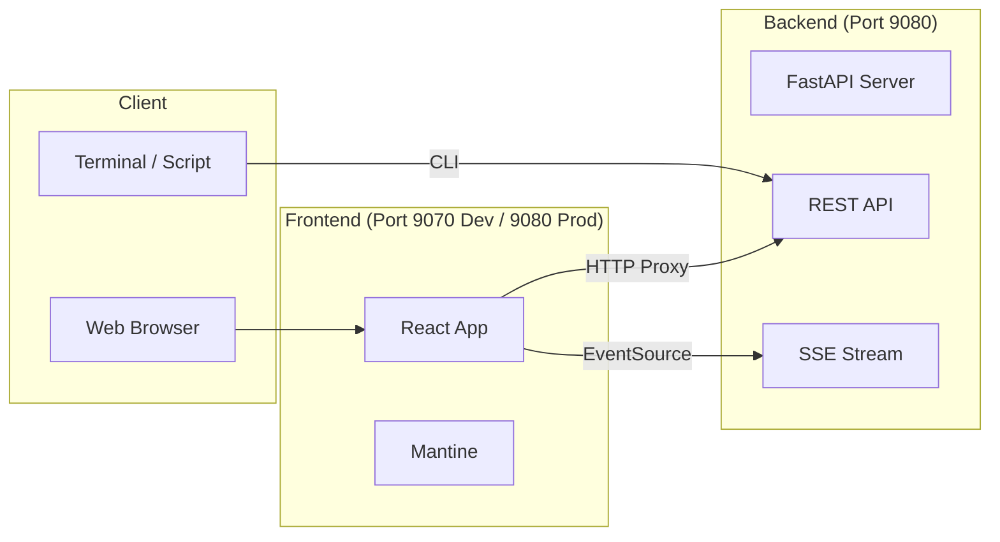
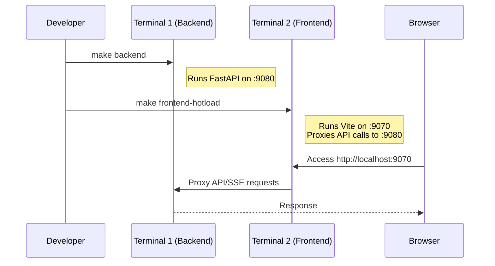
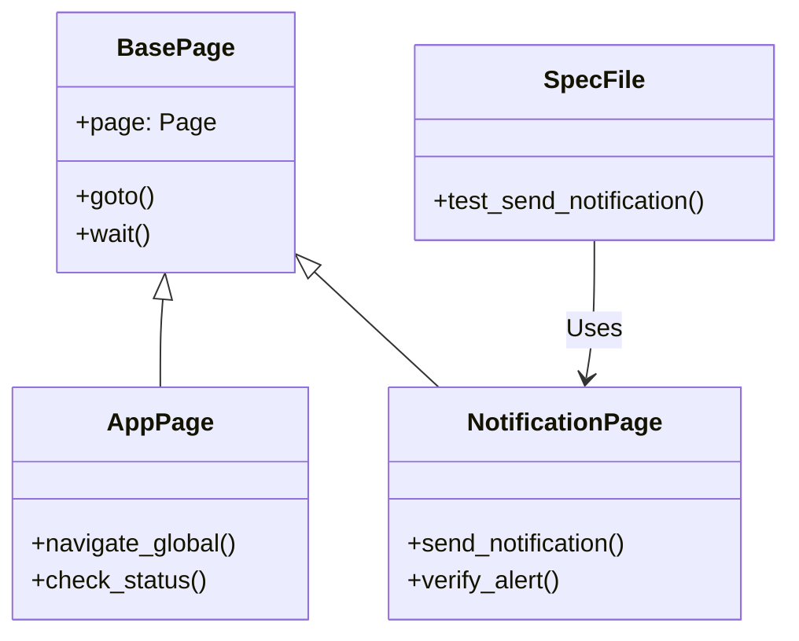

# NotifyHub

> **Summary**: NotifyHub is a single-page notification application designed for developers. It provides a real-time notification center where external processes, CLI tools, and CI/CD pipelines can push notifications. It was built primarily for integration with the **OpenCode** AI coding assistant, but serves as a general-purpose notification hub.

- [NotifyHub](#notifyhub)
  - [1. What Is This Project?](#1-what-is-this-project)
  - [2. Tech Stack](#2-tech-stack)
  - [3. Directory Structure](#3-directory-structure)
  - [4. Frontend Architecture](#4-frontend-architecture)
  - [5. State Management](#5-state-management)
  - [6. Real-time Communication](#6-real-time-communication)
  - [7. Audio Handling](#7-audio-handling)
  - [8. Testing Setup](#8-testing-setup)
  - [9. Build Tooling](#9-build-tooling)
  - [10. Installation & Setup](#10-installation--setup)
  - [11. Backend Configuration](#11-backend-configuration)
  - [12. Frontend Loading Modes](#12-frontend-loading-modes)
  - [13. Production Usage](#13-production-usage)
  - [14. Testing Strategy](#14-testing-strategy)
  - [15. CLI Usage](#15-cli-usage)

## 1. What Is This Project?

**NotifyHub** is a single-page notification app for developers, combining Python FastAPI backend with React frontend. Uses Server-Sent Events for real-time alerts and includes audio notifications with autoplay. Features CLI integration, Mantine UI, and Playwright testing. Supports hot-reload development and production static serving. The repo contains:

- A **web UI** (React) for viewing/managing notifications
- A **Python backend** (FastAPI) serving REST + SSE
- A **CLI** for pushing notifications from scripts/terminals
- A **TUI** (terminal UI) for viewing notifications in the terminal
- An **OpenCode plugin** to integrate with the OpenCode AI assistant

### Architecture Diagram


```mermaid
graph LR
    subgraph Client
        Browser[Web Browser]
        Terminal[Terminal / Script]
    end

    subgraph "Frontend (Port 9070 Dev / 9080 Prod)"
        React[React App]
        Mantine[Mantine]
    end

    subgraph "Backend (Port 9080)"
        FastAPI[FastAPI Server]
        API[REST API]
        SSE[SSE Stream]
    end

    Browser --> React
    React -- HTTP Proxy --> API
    React -- EventSource --> SSE
    Terminal -- CLI --> API
```

---

## 2. Tech Stack

| Layer | Technology |
|---|---|
| **Backend** | Python 3 + FastAPI + Uvicorn + Pydantic |
| **Frontend** | React 18, TypeScript |
| **Styling** | Mantine v8 (UI components), PostCSS + Autoprefixer, custom CSS |
| **Build / Package Manager** | **Bun** (package manager and runtime for `bun run dev`), **Vite 5** (bundler) |
| **Real-time** | Server-Sent Events (SSE) via `sse-starlette` |
| **Animation** | Framer Motion |
| **Hashing** | crypto-js (MD5 for avatar color generation) |
| **Backend Testing** | pytest + pytest-asyncio + HTTPX (FastAPI TestClient) |
| **Frontend Testing** | Playwright with Page Object Model, connecting via Chrome DevTools Protocol (CDP) |
| **Config Stack** | Custom `confstack` library for layered config (defaults -> config file -> CLI args) |
| **Containerization** | Docker (multi-stage: Node 18 Alpine for frontend build, Python 3.11 slim for backend) |
| **Language Server** | Pyright |

---

## 3. Directory Structure

```
NotifyHub/
├── README.md
├── Makefile                          # Task runner for all operations
├── pyproject.toml                    # Python packaging (setuptools)
├── requirements.txt
├── pytest.ini
├── pyrightconfig.json
├── Dockerfile                        # Multi-stage: frontend build + backend
├── docker-compose.yml
├── docs/                             # Plans, issues, code reviews
│   ├── plans/
│   ├── issues/
│   └── refs/
├── local/                            # Shell scripts (e.g., noti.sh)
├── exp/                              # Experimental / scratch space
└── src/
    └── notifyhub/
        ├── __init__.py
        ├── config.py                 # Pydantic config models with ConfStack
        ├── telegram.py               # Telegram bot integration
        ├── backend/
        │   ├── backend.py            # FastAPI app, SSE, API routes, server entrypoint
        │   ├── models.py             # Notification Pydantic model + NotificationStore
        │   └── __tests__/
        │       ├── test_models.py    # Unit tests for NotificationStore
        │       └── test_server.py    # API integration tests via TestClient
        ├── cli/
        │   ├── cli.py                # CLI tool to push notifications
        │   └── __tests__/
        ├── tui/                      # Terminal UI (React + @opentui)
        │   ├── package.json
        │   ├── tsconfig.json
        │   └── src/
        │       ├── index.tsx
        │       ├── App.tsx
        │       ├── types.ts
        │       ├── components/
        │       ├── hooks/
        │       └── utils/
        ├── plugins/
        │   └── opencode/             # OpenCode integration plugin
        │       ├── notifyhub-plugin.ts
        │       ├── opencode-trace.py
        │       └── package.json
        └── frontend/
            ├── package.json          # Bun-managed deps
            ├── vite.config.js        # Vite config with proxy
            ├── postcss.config.js     # PostCSS with autoprefixer
            ├── tailwind.config.js    # Tailwind config (dark mode, class-based)
            ├── playwright.config.ts  # Playwright test config
            ├── index.html            # Entry HTML (Inter font, Bootstrap CDN)
            ├── static/               # Build output (Vite outputs here as "outDir")
            ├── public/
            │   └── audio/            # Audio files (Submarine.mp3)
            └── src/
                ├── main.tsx          # React entry: MantineProvider + StrictMode
                ├── App.tsx           # Main app component (SSE, audio, state)
                ├── theme.ts          # Mantine theme customization
                ├── index.css         # Global CSS (Mantine imports)
                ├── notification.css  # Notification-specific custom CSS
                ├── models/
                │   └── NotificationData.ts  # Notification class
                ├── components/
                │   └── NotificationCard.tsx  # Individual notification card
                └── utils/
                    ├── timestampUtils.ts
                    └── timestampUtils.test.ts
```

---

## 4. Frontend Architecture

- **Framework**: React 18, with `createRoot` rendering into `#root`
- **UI Library**: **Mantine v8** — provides `Box`, `Button`, `Alert`, `Title`, `Avatar`, `Text`, `Container`, `MantineProvider` with `ColorSchemeScript`. A custom Mantine theme is defined in `theme.ts` with Inter font family, custom blue palette, and card border styling.
- **CSS Approach**: Hybrid:
  1. **Mantine's CSS variable system** — imported via `@mantine/core/styles/` (global, baseline, CSS variables)
  2. **Custom CSS** — `notification.css` for Apple-style notification cards, using Mantine's CSS variable tokens (`--mantine-color-gray-5`, `--mantine-radius-lg`, etc.)
  3. **Tailwind CSS** — config present (`tailwind.config.js` with `darkMode: 'class'`) but appears minimally used (vestigial from a migration from Tailwind to Mantine)
  4. **PostCSS** — only `autoprefixer` plugin active
  5. **Bootstrap CDN** linked in `index.html` but not relied upon programmatically
- **Animation**: **Framer Motion** — `AnimatePresence` wrapper with `motion.div` on each notification card, using spring animations for layout transitions and scroll-based compression (cards fade/scale down when near the bottom 15% of the viewport to create a fan-in effect). Animations use `layout` property for automatic layout animations.
- **Component Tree**:
  - `<MantineProvider>` wraps `<App>`
  - `<App>` holds state, manages SSE connection, renders header + status alerts + `<NotificationCard>` list
  - `<NotificationCard>` renders individual cards with avatar, title, timestamp, message parsing

---

## 5. State Management

There is **no external state management library** (no Redux, Zustand, MobX, etc.). State is handled purely via React hooks:

- **`useState`** in `App.tsx` manages:
  - `notifications: Notification[]` — list of all notifications
  - `connectionError: boolean` — SSE connection status
  - `eventSource: EventSource | null` — the SSE connection reference
  - `audioBlocked: boolean` — whether browser blocked autoplay
- **`useRef`** for `audioRef: HTMLAudioElement | null`
- **`useEffect`** for:
  - SSE connection lifecycle (single `EventSource` connection on mount)
  - Audio element creation and autoplay handling
  - Scroll/resize listeners in `NotificationCard` for compression calculations
  - Timer for updating relative timestamps every 60 seconds
- State is **derived directly from SSE events** — the backend pushes `init` (full state), `notification` (new), `clear` (delete all), `delete` (single delete), `heartbeat` events, and the frontend simply updates its local state array accordingly.

---

## 6. Real-time Communication

The project uses **Server-Sent Events (SSE)**, not WebSockets:

- **Backend** (`backend.py`):
  - `SSEManager` class maintains a list of `asyncio.Queue` connections
  - `connect()` adds a new queue, `disconnect()` removes on close, `broadcast()` sends to all connected clients
  - The `/events` endpoint returns an `EventSourceResponse` that yields events: `init` (all current notifications), `notification`, `clear`, `delete`, `heartbeat` (every N seconds, configurable), and `shutdown`
  - Uses `asyncio.wait_for(queue.get(), timeout=1.0)` for a non-blocking loop with heartbeat counting

- **Vite proxy** (`vite.config.js`):
  - `/events` is proxied to `http://localhost:9080` with `ws: true` (WebSocket support in proxy config, though the app uses SSE not WS)

- **Frontend** (`App.tsx`):
  - Single `EventSource` connects to `/events` on mount
  - Listens for named events: `init`, `notification`, `clear`, `delete`, `heartbeat`
  - `onerror` sets `connectionError = true`; `onopen` resets it
  - A single heartbeat event resets the error state (acts as a connectivity check)
  - REST API calls (`fetch`) are used for mutations: `DELETE /api/notifications` to clear all, with the server then broadcasting the clear event via SSE

---

## 7. Audio Handling

- **Audio file**: `public/audio/Submarine.mp3` (referenced as `/audio/Submarine.mp3`, served by FastAPI at the `/audio` mount point)
- **Setup**: An `<audio>` element is created programmatically in a `useEffect`, with `volume = 0.5`
- **Autoplay handling**: Browsers block autoplay by default. On each new notification:
  1. `audioRef.current.currentTime = 0` (reset to start)
  2. `audioRef.current.play()` is called
  3. If it fails (catches error), `audioBlocked` is set to `true`
  4. When `audioBlocked` is true, a click listener is added to the `document`, and the page title changes to "Notification Center | Muted. Please click to enable audio notifications"
  5. On first user click, audio is played, `audioBlocked` resets, and the click listener is removed

---

## 8. Testing Setup

**Backend Tests** (pytest):
- Located at `src/notifyhub/backend/__tests__/`
- Uses `pytest`, `pytest-asyncio`, `httpx`, and FastAPI's `TestClient`
- `test_models.py`: 7 test methods covering `NotificationStore` initialization, add, order, max limit, edge cases, delete by ID (existing, nonexistent, empty)
- `test_server.py`: 10 test methods across 4 classes covering REST API endpoints (`POST /api/notify`, `GET /api/notifications`, `DELETE /api/notifications`, `GET /`), including success, empty, order, individual deletion, non-existent deletion
- Run with: `make test-backend` → `python -m pytest src/notifyhub/backend/__tests__/ -v`

**Frontend E2E Tests** (Playwright):
- Located at `src/notifyhub/frontend/__tests__/`
- **Page Object Model** pattern: `BasePage` → `AppPage` + `NotificationPage`
- `notification.spec.ts`: Uses Playwright's `extend` to connect over Chrome DevTools Protocol (CDP) to an already-running browser instance
- Testing strategy: Backup-and-restore approach — backs up existing notifications before tests, adds 8 mock notifications, runs tests, then restores original state
- Run with: `make test-frontend` (production mode, port 9080) or `make test-frontend-hotload` (dev mode, port 9070)
- Playwright config: 30s timeout, video retention on failure, `baseURL: http://localhost:9080`

**Unit Tests**:
- `timestampUtils.test.ts` for the timestamp formatter utility

---

## 9. Build Tooling

- **Package Manager**: **Bun** (`bun install`, `bun run dev`, `bun run build`)
- **Bundler**: **Vite 5** with `@vitejs/plugin-react`
- **Vite config highlights**:
  - Dev server on port 9070
  - Proxy: `/api` → `localhost:9080`, `/events` → `localhost:9080` (with `ws: true`)
  - Build output: `static/` directory, single entry `src/main.tsx`
  - Deterministic asset naming (`app.js` for entry, `[name].js` for chunks, `[name].[ext]` for assets)
- **Python**: Built with `setuptools` (editable install via `pip install -e .`), scripts registered via `project.scripts` in `pyproject.toml`
- **Task Runner**: `Makefile` with shorthand aliases (`be`, `fe`, `fehl`, `tbe`, `tfe`, `tfehl`, `ta`) for quick development
- **Type checking**: `pyrightconfig.json` for Python, `tsconfig.json` for TypeScript; the TUI has `bun run typecheck` (`tsc --noEmit`)
- **Linting**: `ruff` for Python (with `.ruff_cache/`), `.ripgreprc` for search config

### Key Architectural Patterns

1. **Layered config**: `ConfStack` merges defaults → JSON config file → CLI args
2. **SSE-only real-time**: No WebSockets; the app uses `asyncio.Queue` per client for server-side SSE multiplexing
3. **Fan-in compression**: Notification cards dynamically compress (fade, scale down) as they approach the bottom 15% of the viewport, creating a visual depth-of-field effect
4. **Dual-serving modes**: Hot-reload (Vite on 9070 + FastAPI on 9080 with proxy) vs. production (FastAPI serves built static files from `static/` on port 9080)
5. **CDP-based testing**: Playwright tests connect to an already-open Chrome instance rather than launching a new browser, for testing against a manually-observed session
6. **OpenCode integration**: Plugin files in `plugins/opencode/` allow OpenCode to push events to NotifyHub, with session/message tracing
7. **Terminal UI**: A separate React-based TUI (`src/notifyhub/tui/`) using `@opentui` for terminal rendering

---

## 10. Installation & Setup

### Prerequisites

- Python 3.x
- Bun (JavaScript runtime/package manager)
- VSCode Extensions:
  - [CSS Navigation](https://marketplace.visualstudio.com/items?itemName=pucelle.vscode-css-navigation) - Enables Ctrl+click navigation for CSS imports and variable definitions

### Initial Install

Run the following to set up both backend and frontend dependencies:

```bash
# Install backend dependencies (editable mode)
pip install -e .

# Install frontend dependencies (includes testing tools)
make frontend-deps

# (Optional) Build web assets immediately
make frontend
```

### OpenCode Plugin Installation (Optional)

To integrate NotifyHub with OpenCode, you can install the NotifyHub plugin:

```bash
# Install the plugin
make install-plugin

# Remove the plugin (if needed)
make remove-plugin
```

This copies the plugin file from `src/notifyhub/plugins/opencode/notifyhub-plugin.ts` to `~/.config/opencode/plugin/` and enables NotifyHub notifications in OpenCode.

---

## 11. Backend Configuration

NotifyHub backend supports configuration via command-line arguments and a JSON config file for flexible deployment options.

### Command-Line Options

The backend accepts the following CLI arguments:

```bash
python -m notifyhub.backend.backend [options]
```

| Option                      | Default   | Description                                                   |
| --------------------------- | --------- | ------------------------------------------------------------- |
| `--backend.port`                    | 9080      | Port to run the server on                                     |
| `--backend.host`                    | "0.0.0.0" | Host to bind the server to                                    |
| `--backend.sse-heartbeat-interval`  | 30        | SSE heartbeat interval in seconds                             |
| `--backend.notifications-max-count` | None      | Maximum number of notifications to store (None for unlimited) |

**Examples:**

```bash
# Run with custom port and host
python -m notifyhub.backend.backend --backend.port 8080 --backend.host 127.0.0.1

# Limit notifications to 100 and faster heartbeat
python -m notifyhub.backend.backend --backend.notifications-max-count 100 --backend.sse-heartbeat-interval 15
```

### Configuration File

For persistent configuration, create a JSON file at `~/.config/notifyhub/config.json`:

```json
{
  "backend": {
    "port": 9080,
    "host": "0.0.0.0",
    "sse_heartbeat_interval": 30
  }
}
```

**Configuration Hierarchy:**
1. Hardcoded defaults
2. Config file values (if file exists)
3. CLI arguments (highest priority)

**Example config location:**
- macOS/Linux: `~/.config/notifyhub/config.json`
- Copy from: `src/notifyhub/example_config.json`

---

## 12. Frontend Loading Modes

For hot-reloading, run the backend and frontend in separate terminals.

### Hot-reload Diagram


```mermaid
sequenceDiagram
    participant Dev as Developer
    participant Term1 as Terminal 1 (Backend)
    participant Term2 as Terminal 2 (Frontend)
    participant Browser

     Dev->>Term1: make backend
     Note right of Term1: Runs FastAPI on :9080
     Dev->>Term2: make frontend-hotload
     Note right of Term2: Runs Vite on :9070<br/>Proxies API calls to :9080

    Browser->>Term2: Access http://localhost:9070
    Term2->>Term1: Proxy API/SSE requests
    Term1-->>Browser: Response

```

### Why the Proxy is Needed

In hot-reload mode, frontend runs on port 9070 and backend on port 9080. Since browsers block requests between different ports (CORS), the Vite dev server acts as a proxy—intercepting API calls from the browser, forwarding them to the backend on port 9080, and returning the response. The browser only sees port 9070, avoiding CORS issues.

**Setup:**

| Mode       | Frontend | Backend | Proxy Needed?        |
| ---------- | -------- | ------- | -------------------- |
| Hot-reload | `:9070`  | `:9080` | Yes                  |
| Static     | `:9080`  | `:9080` | No (served together) |

**Hot-reload flow:**

```
Browser → Frontend (:9070) → Proxy → Backend (:9080)
```

**Benefits:**

- No CORS configuration needed on backend
- Frontend hot-reloading enabled
- Clean separation of concerns

### Commands

**Terminal 1: Start Backend**

```bash
make backend
# Serves on http://localhost:9080
```

**Terminal 2: Start Frontend (Hot-Reload)**

```bash
make frontend-hotload
# Serves on http://localhost:9070 (Proxies to backend)
```

> **Note:** Access the UI at **`http://localhost:9070`** for hot-reloading.

---

## 13. Production Usage

To run the application as it would appear in production (serving built static assets via FastAPI):

1. **Build Assets:**

```bash
make frontend
# Builds React app to src/notifyhub/frontend/static/
```

2. **Start Server:**

```bash
make backend
# FastAPI serves static files from static/ at:
# - /static/* (general assets like JS/CSS)
# - /icons/* (icon files)
# - /audio/* (audio files)
# Note: When adding new asset folders to static/, update backend.py mounts accordingly.
```

3. **Access:**
   Open **`http://localhost:9080`**. (Default: Dark Theme).
4. **Send Test Notification (CLI):**

```bash
make noti
```

---

## 14. Testing Strategy

NotifyHub uses a combination of `pytest` for the backend and `Playwright` for frontend UI testing.

### Test Architecture (Page Object Model)


```mermaid
classDiagram
    class BasePage {
        +page: Page
        +goto()
        +wait()
    }
    class AppPage {
        +navigate_global()
        +check_status()
    }
    class NotificationPage {
        +send_notification()
        +verify_alert()
    }
    class SpecFile {
        +test_send_notification()
    }

    BasePage <|-- AppPage
    BasePage <|-- NotificationPage
    SpecFile --> NotificationPage : Uses

```

### 14.1 UI Test Setup

Before running UI tests, ensure Playwright browsers are installed:

```bash
# Install dependencies
cd src/notifyhub/frontend && bun install

# Install Playwright browsers
npx playwright install
```

### 14.2 Running Tests

You can run tests via standard NPM commands or the provided Makefile shortcuts.

| Scope            | Command                      | Description                                     |
| ---------------- | ---------------------------- | ----------------------------------------------- |
| **Backend**      | `make test-backend`          | Run pytest (backend only)                       |
| **UI (Prod)**    | `make test-frontend`         | Run Playwright tests against port 9080 (headed) |
| **UI (Hotload)** | `make test-frontend-hotload` | Run Playwright tests against port 9070 (headed) |
| **Connection**   | `make test-chrome`           | Test Chrome CDP connection utility              |
| **All**          | `make test-all`              | Run entire test suite                           |

### 14.3 Test Organization

The project follows the Page Object Model (POM) design pattern:

```text
src/notifyhub/frontend/__tests__/
├── pages/                  # Page Object Model classes
│   ├── AppPage.ts          # App-wide interactions
│   ├── BasePage.ts         # Base class with common methods
│   └── NotificationPage.ts # Notification-specific actions
├── specs/                  # Test specifications
│   └── notification.spec.ts
├── utils/                  # Helper utilities
│   └── test_chrome_connection.ts
└── tsconfig.json           # TypeScript configuration

src/notifyhub/backend/__tests__/
├── test_models.py          # Model tests
└── test_server.py         # Server tests

src/notifyhub/cli/__tests__/
└── test_cli.py             # CLI tests
```

#### Notification Test Strategy

The `notification.spec.ts` test suite implements a backup-and-restore approach for testing. See the detailed documentation in the test file itself (`src/notifyhub/frontend/__tests__/specs/notification.spec.ts`) for the complete strategy.

### 14.4 Chrome Remote Debugging (CDP)

Tests can connect to an existing Chrome instance via the Chrome DevTools Protocol (CDP). This requires launching Chrome with specific flags.

**macOS:**

```bash
/Applications/Google\ Chrome.app/Contents/MacOS/Google\ Chrome --remote-debugging-port=9222 --remote-debugging-address=0.0.0.0 --user-data-dir=/tmp/chrome-debug
```

**Linux:**

```bash
google-chrome --remote-debugging-port=9222 --remote-debugging-address=0.0.0.0 --user-data-dir=/tmp/chrome-debug
```

---

## 15. CLI Usage

NotifyHub provides a CLI for sending notifications:

```bash
python src/notifyhub/cli/cli.py --backend.port 9080 '{"message": "Hello World"}'
```
