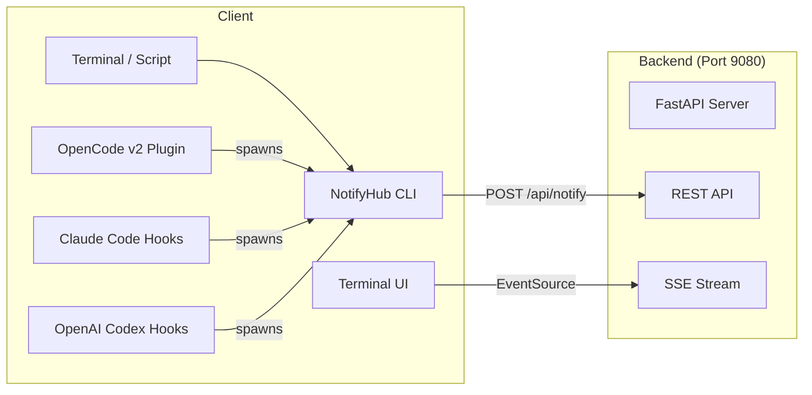

# NotifyHub

> **Summary**: NotifyHub is a notification hub designed for developers. It provides a real-time notification center where external processes, CLI tools, and CI/CD pipelines can push notifications. It was built primarily for integration with the **OpenCode** AI coding assistant, and also ships integrations for **Claude Code** and **OpenAI Codex**, but serves as a general-purpose notification hub.

- [NotifyHub](#notifyhub)
  - [1. What Is This Project?](#1-what-is-this-project)
  - [2. Tech Stack](#2-tech-stack)
  - [3. Directory Structure](#3-directory-structure)
  - [4. Real-time Communication](#4-real-time-communication)
  - [5. Installation & Setup](#5-installation--setup)
  - [6. Backend Configuration](#6-backend-configuration)
  - [7. Testing Strategy](#7-testing-strategy)
  - [8. CLI Usage](#8-cli-usage)
  - [9. Terminal UI (TUI)](#9-terminal-ui-tui)

## 1. What Is This Project?

**NotifyHub** is a notification hub for developers: a Python FastAPI backend serving REST + SSE, with a terminal UI for viewing notifications. The repo contains:

- A **Python backend** (FastAPI) serving REST + SSE
- A **CLI** for pushing notifications from scripts/terminals
- A **TUI** (terminal UI) for viewing notifications in the terminal
- An **OpenCode v2 plugin** that turns turn completions, errors, permission prompts, and questions into notifications
- **Claude Code** and **OpenAI Codex** hook scripts that provide the same notifications for those coding agents

### Architecture Diagram


```mermaid
graph LR
    subgraph Client
        TUI[Terminal UI]
        Terminal[Terminal / Script]
        OpenCode[OpenCode v2 Plugin]
        Claude[Claude Code Hooks]
        Codex[OpenAI Codex Hooks]
        CLI[NotifyHub CLI]
    end

    subgraph "Backend (Port 9080)"
        FastAPI[FastAPI Server]
        API[REST API]
        SSE[SSE Stream]
    end

    TUI -- EventSource --> SSE
    Terminal --> CLI
    OpenCode -- spawns --> CLI
    Claude -- spawns --> CLI
    Codex -- spawns --> CLI
    CLI -- POST /api/notify --> API
```

---

## 2. Tech Stack

| Layer | Technology |
|---|---|
| **Backend** | Python 3 + FastAPI + Uvicorn + Pydantic |
| **Crypto** | `cryptography` (AES-256-GCM) on the server; WebCrypto in the TUI |
| **TUI** | React + `@opentui` terminal rendering, run with **Bun** |
| **Real-time** | Server-Sent Events (SSE) via `sse-starlette` |
| **Backend Testing** | pytest + pytest-asyncio + HTTPX (FastAPI TestClient) |
| **TUI Testing** | `bun test` |
| **Config Stack** | Custom `confstack` library for layered config (defaults -> config file -> CLI args) |
| **Containerization** | Docker (Python 3.11 slim for the backend) |
| **Language Server** | Pyright |

---

## 3. Directory Structure

```
NotifyHub/
├── README.md
├── Makefile                          # Task runner for all operations
├── pyproject.toml                    # Python packaging (setuptools)
├── requirements.txt
├── pytest.ini
├── pyrightconfig.json
├── Dockerfile                        # Python 3.11 slim backend
├── docker-compose.yml
├── docs/                             # Plans, issues, code reviews
│   ├── plans/
│   ├── issues/
│   ├── refs/
│   └── _meta/                        # How-to guides (e.g., how-to-prototype.md)
├── tests/                            # pytest suites (tests/notifyhub/...)
├── local/                            # Shell scripts (e.g., push-funnel-noti.sh)
├── exp/                              # Experimental / scratch space
└── src/
    └── notifyhub/
        ├── __init__.py
        ├── config.py                 # Pydantic config models (loaded via confstackify)
        ├── crypto.py                 # AES-256-GCM envelope crypto + key resolution
        ├── telegram.py               # Telegram bot integration
        ├── backend/
        │   ├── backend.py            # FastAPI app, SSE, API routes, server entrypoint
        │   └── models.py             # Notification record + NotificationStore
        ├── cli/
        │   ├── cli.py                # CLI tool to push notifications
        │   └── __tests__/
        ├── tui/                      # Terminal UI (React + @opentui)
        │   ├── package.json
        │   ├── tsconfig.json
        │   └── src/
        │       ├── index.tsx
        │       ├── prototype.tsx        # mock-data harness entry
        │       ├── render.tsx
        │       ├── App.tsx              # AppView shell + live data wiring
        │       ├── types.ts
        │       ├── prototypes/          # harness, scenarios, temporary seams
        │       ├── components/
        │       ├── hooks/
        │       └── utils/                # api.ts, crypto.ts (e2e decrypt)
        └── plugins/
            ├── opencode/             # OpenCode v2 integration plugin
            │   ├── notifyhub-plugin.ts
            │   ├── package.json
            │   └── tsconfig.json
            ├── claude/               # Claude Code hooks integration
            └── codex/                # OpenAI Codex hooks integration
```

---

## 4. Real-time Communication

The project uses **Server-Sent Events (SSE)**, not WebSockets:

- **Backend** (`backend.py`):
  - `SSEManager` class maintains a list of `asyncio.Queue` connections
  - `connect()` adds a new queue, `disconnect()` removes on close, `broadcast()` sends to all connected clients
  - The `/events` endpoint returns an `EventSourceResponse` that yields events: `init` (current notifications, capped by the optional `?limit=` query param), `notification`, `clear`, `delete`, `heartbeat` (every N seconds, configurable), `shutdown`, and `agent_status` (live agent session states — see below)
  - Uses `asyncio.wait_for(queue.get(), timeout=1.0)` for a non-blocking loop with heartbeat counting
  - `GET /api/notifications` supports pagination via `?limit=`, `?offset=`, and `?before=<id>` (stable cursor for loading older items); `GET /api/notifications/count` returns `{"count": N}` without shipping the full payload. This keeps large histories from being loaded into memory at once.

### Live agent status (`/api/status`)

The backend also tracks **which agent session is doing what right now** (RAM-only, herdr-style):
the opencode plugin and the claude/codex hooks report `running` / `blocked` / `idle` per session
to `POST /api/status/<agent>/<state>`, and every meaningful change is broadcast as an SSE
`agent_status` event. Entries carry the directory, host, a one-line excerpt of the running task,
and turn `stale` after `backend.agent_status_stale_seconds` (default 300) without a refresh.
Reporters also heartbeat — an opencode in-process ticker plus detached claude/codex watcher
processes re-post `running` (with a `heartbeat` flag) every 60s during long turns, so a silent
5-minute tool call no longer reads as `stalled?`; only a genuinely dead agent does.
Completion notifications carry `data.session_id`, so clients can resolve a running row exactly
when its turn's notification lands. The TUI (§9) renders these as waiting notification cards;
operator guide: [`docs/important/agent-status.md`](docs/important/agent-status.md).

- **TUI** (`hooks/`, `utils/api.ts`):
  - Single `EventSource` connects to `/events?limit=30` on startup
  - Listens for named events: `init`, `notification`, `agent_status`, `clear`, `delete`, `heartbeat`, `shutdown`
  - A 15-second poll calls `GET /api/notifications/count`, never re-downloading the full list
  - REST calls handle mutations and pagination (see [Paginated loading](#paginated-loading))

---

## 5. Installation & Setup

### Prerequisites

- Python 3.x
- Bun (JavaScript runtime/package manager, for the TUI)

### Initial Install

Run the following to set up backend and TUI dependencies:

```bash
# Install backend dependencies (editable mode)
pip install -e .

# Install TUI dependencies
make tui-deps
```

### Start the backend

```bash
make backend
# Serves the API + SSE stream on http://localhost:9080
```

### Send a test notification

```bash
make noti
```

### E2E Encryption (Optional)

To encrypt payloads at rest / in transit (server decrypts for push, stores and
serves only ciphertext; the TUI decrypts locally):

```bash
make e2e-status    # show the resolved key source + kid (never prints the key)
make e2e-key       # fallback: generate a standalone ~/.config/notifyhub/e2e.key
```

Then add the key next to your other settings in `~/.config/notifyhub/config.jsonl`:

```jsonc
"e2e": { "enabled": true, "key": "YOUR_KEY" }
```

Both the server and the TUI read it from there (`NOTIFYHUB_E2E_KEY` env
overrides). See [Backend Configuration](#6-backend-configuration) for details.

### Coding-agent integration maintenance

`make install-plugin` refreshes OpenCode, the shared push CLI, Claude, and Codex together.
`make install-plugin-ssh` rolls the same set out to SSH hosts picked interactively from
`~/.ssh/config`. Restart Claude and long-lived OpenCode processes; review changed Codex
definitions via `/hooks`.
See [installation and rollout](docs/important/plugin-installation.md),
[machine label precedence](docs/important/notification-machine-labels.md), and
[isolated regression checks](docs/important/plugin-integration-testing.md).

The [2026-11-12 session record](docs/plans/2026/11/12/2026-11-12-plugin-labels-installation-and-permissions.md) links the parent and all affected submodules,
including hook-definition distributions, CLI contract, and tests. It records the hostname/label
mismatch, aggregate installation change, OpenCode autoaccept race, actual verification, and limits.

### OpenCode Plugin Installation (Optional)

The repo ships a plugin for **OpenCode v2.0.18+** that pushes turn completions, errors, permission prompts,
and questions to NotifyHub. See [`docs/important/opencode-plugin.md`](docs/important/opencode-plugin.md)
for the full guide.

| OpenCode v2 event | Notification |
|---|---|
| `session.execution.succeeded` / `session.execution.interrupted` | `[#tag:@USER] …` + `[#tag:@ASSISTANT] …` message excerpts |
| `session.execution.failed` | `[#opencode.error] <error message>` |
| `permission.asked` | `[#opencode.permission] OpenCode needs your permission` |
| `form.created` (the `question` tool) | `[#opencode.question] OpenCode is asking you a question` |

```bash
make install-plugin   # installs OpenCode + shared push CLI + Claude and Codex hooks
make backend          # start the NotifyHub server
opencode plugin list  # verify: id "notifyhub", state "active"
make remove-plugin    # uninstall
```

`make install-plugin` installs all three integrations. For individual updates, use
`make install-plugin-copy` (OpenCode and the shared CLI), `make install-plugin-claude`, or
`make install-plugin-codex`. Restart Claude sessions and trust Codex hooks via `/hooks` after
installation.

`make install-plugin-ssh` installs the same set on remote machines: hosts are marked right
in `~/.ssh/config` with a `# notifyhub` comment on the `Host` line (e.g. `Host nuc  # notifyhub`;
a wildcard line like `Host wsk* # notifyhub` claims every alias it matches), and only those are
offered in the multi-select. With no markers every host stays eligible. Selected hosts each get
one tar-over-ssh stream (parallel, one color tag per host). Previous installs are archived
`__archived__/`-style before being replaced, and the Claude/Codex hook merges run on the host
itself, so their settings entries reference the persistent copy in
`~/.config/notifyhub/plugin/`. It needs no prompts when driven by args:
`make install-plugin-ssh ARGS="-t opencode -H nuc,pp"` (or `ARGS="--all --dry-run"` to print
the plan; `--ssh-hosts "*"` escapes the marker limit for one run). Remote hosts push back to
the server through `NOTIFYHUB_CLI_HOST`, which must point at this machine there.

The [2026-11-12 session record](docs/plans/2026/11/12/2026-11-12-install-plugin-ssh.md) links the
parent and per-area records, covering the installer script, the host-selection design (a config
glob list that was reverted in favor of the ssh-config marker), and the `make config-md` repair.

Permission alerts wait one second for autoaccept replies and check the request is still pending
before notifying. OpenCode status cards use the same `HOST_MODEL` → `HOSTNAME` → OS hostname
label as completed notifications.

The plugin is a **dependency-free single file** (type-only import of `@opencode/plugin`, so no
`node_modules` is needed in `~/.config/opencode`), hot-reloads when the installed file changes, and reads
`NOTIFYHUB_CLI_HOST`, `NOTIFYHUB_CLI_PORT`, `NOTIFYHUB_CLI_SCHEME`, `NOTIFYHUB_CLI_ENABLED`, `NOTIFYHUB_PUSH_SCRIPT`,
`NOTIFYHUB_HEARTBEAT_INTERVAL_MS`, and `NOTIFYHUB_HEARTBEAT_MAX_MINUTES`. It also
mutes specific agents via `plugins.opencode.muted_agents` in the NotifyHub config (or the comma-separated
`NOTIFYHUB_PLUGINS_OPENCODE_MUTED_AGENTS`). Development happens in `src/notifyhub/plugins/opencode/`:

```bash
make plugin-deps      # npm install (types for the v2 plugin API)
cd src/notifyhub/plugins/opencode && npm run typecheck
```

### Claude Code Hooks (Optional)

The same notifications are available for **Claude Code** via its hooks system — see
[`docs/important/claude-code-hooks.md`](docs/important/claude-code-hooks.md) for the full guide.
Claude Code has no in-process plugin event stream, so the port is a Python hook script it spawns
per event, plus a merge-preserving settings installer and a plugin-layout alternative:

| Claude Code hook | Notification |
|---|---|
| `Stop` | `[#tag:@USER] …` + `[#tag:@ASSISTANT] …` message excerpts |
| `StopFailure` | `[#claude-code.error] <error message>` |
| `Notification` (`permission_prompt`) | `[#claude-code.permission] <message>` |
| `Notification` (elicitation / `agent_needs_input`) | `[#claude-code.question] <message>` |

```bash
make install-plugin         # installs OpenCode, Claude, and Codex integrations together
make backend                # start the NotifyHub server
# restart Claude Code sessions, then verify with /hooks
make remove-plugin-claude   # uninstall
```

Claude live-status and completion cards use the same machine label: `HOST_MODEL` (ignoring empty
or `Unknown`), then exported `HOSTNAME`, then the OS hostname. Re-run `make install-plugin-claude`
and restart Claude sessions after upgrading the status hooks (turn start now also spawns the
heartbeat watcher; per-tool refresh stays the curl one-liner).

Hooks run straight from `src/notifyhub/plugins/claude/notifyhub-claude.py` (live edits, no
reinstall), share `notifyhub-push.py` and the mute env vars with the OpenCode plugin, and the
directory doubles as a Claude Code plugin (`claude --plugin-dir src/notifyhub/plugins/claude`).
Port history: [`docs/plans/2026/10/23/2026-10-23-claude-code-hooks-port.md`](docs/plans/2026/10/23/2026-10-23-claude-code-hooks-port.md).

### OpenAI Codex Hooks (Optional)

Codex live-status cards use the same `HOST_MODEL` → `HOSTNAME` → OS hostname precedence as
completion cards. Re-run `make install-plugin-codex` and re-trust changed entries via `/hooks`
after upgrading.

The same notifications are available for **OpenAI Codex** (hooks are enabled by default) — see
[`docs/important/codex-hooks.md`](docs/important/codex-hooks.md) for the full guide. Codex also
spawns hook scripts per event, but requires non-managed hooks to be trusted once through `/hooks`:

| Codex hook | Notification |
|---|---|
| `Stop` | `[#tag:@USER] …` + `[#tag:@ASSISTANT] …` message excerpts |
| `Interrupt` | same body, recovered from the transcript |
| `PostModelRequest` (`status: failed`) | `[#codex.error] <error message>` |
| `PermissionRequest` (human reviewer) | `[#codex.permission] <reason or tool name>` |
| `PreToolUse` (`request_user_input`) | `[#codex.question] <question>` |

```bash
make install-plugin         # installs OpenCode, Claude, and Codex integrations together
make backend                # start the NotifyHub server
# open /hooks in a Codex session and trust the NotifyHub entries
make remove-plugin-codex    # uninstall
```

The installer respects `CODEX_HOME`, preserves foreign hooks, and warns when `config.toml` also has
inline `[hooks]` tables. Completion/error hooks run synchronously because `codex exec` cancels
unfinished background hooks when it exits; permission and question hooks stay async so they never
delay a prompt. Permission notifications are skipped when Codex auto-reviews the request
(`approvals_reviewer = "auto_review"`) or runs in Full Access, so only prompts that actually wait for
you notify. The directory doubles as a Codex plugin (`.codex-plugin/plugin.json` +
`hooks/hooks.json`) for marketplace / desktop distribution.
Port history: [`docs/plans/2026/11/09/2026-11-09-codex-hooks-port.md`](docs/plans/2026/11/09/2026-11-09-codex-hooks-port.md).

---

## 6. Backend Configuration

NotifyHub backend supports configuration via command-line arguments and a JSON config file for flexible deployment options.

### Command-Line Options

The backend accepts the following CLI arguments:

```bash
python -m notifyhub.backend.backend [options]
```

| Option                      | Default   | Description                                                   |
| --------------------------- | --------- | ------------------------------------------------------------- |
| `--backend.port`                    | 9080      | Port to run the server on                                     |
| `--backend.host`                    | "0.0.0.0" | Host to bind the server to                                    |
| `--backend.sse-heartbeat-interval`  | 30        | SSE heartbeat interval in seconds                             |
| `--backend.notifications-max-count` | 1000      | Maximum number of notifications to store (None for unlimited) |

**Examples:**

```bash
# Run with custom port and host
python -m notifyhub.backend.backend --backend.port 8080 --backend.host 127.0.0.1

# Limit notifications to 100 and faster heartbeat
python -m notifyhub.backend.backend --backend.notifications-max-count 100 --backend.sse-heartbeat-interval 15
```

### Configuration File

For persistent configuration, create a JSON file at `~/.config/notifyhub/config.json` (or `config.jsonl` for JSON5 with `//` comments, which is what the host uses):

```json
{
  "backend": {
    "port": 9080,
    "host": "0.0.0.0",
    "sse_heartbeat_interval": 30,
    "agent_status_stale_seconds": 300
  }
}
```

`agent_status_stale_seconds` marks a `running` agent-status entry `stale` (crashed
agent, no idle event) after that many seconds without a refresh — see
[live agent status](#live-agent-status-apistatus). Env equivalent:
`NOTIFYHUB_BACKEND_AGENT_STATUS_STALE_SECONDS`.

**Configuration Hierarchy:**
1. Hardcoded defaults
2. Config file values (if file exists)
3. CLI arguments (highest priority)

**Example config location:**
- macOS/Linux: `~/.config/notifyhub/config.json` (or `config.jsonl`)
- Copy from: `src/notifyhub/example_config.json`

---

`pip install -e .` copies the package; the Docker image installs the same way, so `docker compose build be` picks up the `cryptography` dependency automatically.

### End-to-end payload encryption (backend + TUI)

When enabled, notification payloads are stored and served as **AES-256-GCM
envelopes** — the server decrypts only at ingest (so tag matching and
Telegram/Bark/macOS push keep working), then stores/broadcasts ciphertext
only. Consumers (the TUI) decrypt locally with the same pre-shared key.

```json
{
  "backend": { ... },
  "e2e": { "enabled": true, "key": "" }
}
```

- **Key** (base64 or 64-char hex, 256-bit). For a consolidated setup keep it in
  `config.jsonl` under `e2e.key`; it is resolved in order:
  1. `e2e.key` config value (config file / `NOTIFYHUB_E2E_KEY` env) — **server**
  2. `NOTIFYHUB_E2E_KEY` env → `config.jsonl` `e2e.key` — **TUI**
  3. key file: `NOTIFYHUB_E2E_KEY_FILE` or `~/.config/notifyhub/e2e.key`
  4. keychain (macOS `security` / `secret-tool`, service `notifyhub_e2e_key`) — server only
- Generate one: `python -m notifyhub.crypto --gen-key`, or
  `python -m notifyhub.crypto --gen-key --write-default` to write a standalone
  `~/.config/notifyhub/e2e.key`. Check the resolved source with `make e2e-status`
  (prints the `kid`, never the key). ⚠️ an **empty** `NOTIFYHUB_E2E_KEY` still
  overrides the config — only set it non-empty to override.
- The TUI reads the same sources (env → `config.jsonl` → key file), so a key in
  `config.jsonl` lets `make tui` decrypt with no env var. In Docker,
  `~/.config/notifyhub` and `~/git` (read-only) are mounted, so the
  `config.jsonl` symlink resolves inside the container.
- Inbound accepts both plaintext (server encrypts it) and pre-encrypted
  envelopes (`{"e2e":1,"alg":"A256GCM","kid",…,"iv",…,"ct",…}`).
- `GET /api/e2e` reports `{"enabled", "alg", "kid"}` for clients.
- **TUI**: reads the key from `config.jsonl` (or `NOTIFYHUB_E2E_KEY` / a key
  file); undecryptable items render as a `LOCKED` row showing the envelope `kid`,
  and the status popup (`s`) shows server e2e state, local key state, and locked count.
- If `e2e.enabled` is true but no key resolves, the server logs a warning
  and falls back to plaintext (fails safe for availability).
- Only the TUI decrypts — with e2e on, use the TUI to read notifications.

---

## 7. Testing Strategy

NotifyHub uses **pytest** for the backend.

```
tests/notifyhub/backend/
├── test_models.py          # Model tests
├── test_server.py          # Server/API tests (+ TestE2EEncryption)
├── test_status.py          # Live agent status store/API tests
└── test_crypto.py          # Envelope crypto + key resolution

tests/notifyhub/cli/
└── test_cli.py             # CLI tests

tests/notifyhub/plugins/    # Plugin/hook integration checks (no live servers)
```

- Uses `pytest`, `pytest-asyncio`, `httpx`, and FastAPI's `TestClient`
- `backend/test_models.py`: `NotificationStore` initialization, add, order, max limit, delete by ID, opaque `data`
- `backend/test_server.py`: REST endpoints plus `TestE2EEncryption` (plaintext→envelope storage, wrong-key rejection, `/api/e2e`)
- `backend/test_crypto.py`: envelope round-trip, tamper/wrong-key rejection, key resolution, `--status`
- Run with: `make test-backend` → `python -m pytest tests/notifyhub -v`
- TUI: `make tui-test` (`bun test`) and `make tui-typecheck` (`tsc --noEmit`)

Isolated plugin-integration checks (no backend or model requests needed):
[`docs/important/plugin-integration-testing.md`](docs/important/plugin-integration-testing.md).
Organization guide: [`docs/_meta/test-organization.md`](docs/_meta/test-organization.md).
TUI testing guide: [`docs/important/tui-testing-guide.md`](docs/important/tui-testing-guide.md).

---

## 8. CLI Usage

NotifyHub provides a CLI for sending notifications:

```bash
python src/notifyhub/cli/cli.py --backend.port 9080 '{"message": "Hello World"}'
```

By default the CLI talks to `http://0.0.0.0:9080`. To push to a server published
over TLS (for example a Tailscale funnel at `https://nuc.tail0ec64c.ts.net`), set
the scheme to `https` — the funnel's default `443` port is then omitted:

```bash
# Flags…
python src/notifyhub/cli/cli.py --scheme https --host nuc.tail0ec64c.ts.net --port 443 'hello'

# …or env vars (also honored by the OpenCode plugin):
NOTIFYHUB_CLI_SCHEME=https \
NOTIFYHUB_CLI_HOST=nuc.tail0ec64c.ts.net \
NOTIFYHUB_CLI_PORT=443 \
python src/notifyhub/cli/cli.py 'hello'
```

`NOTIFYHUB_CLI_SCHEME` accepts `http`/`https` (case-insensitive; `https://` is
normalized); an empty value falls back to `http`.

For people **outside your tailnet** who just need to push (no Python, no repo),
ship `local/push-funnel-noti.sh` — a dependency-free `bash`+`curl` one-file drop:

```bash
./push-funnel-noti.sh "build finished"          # or pipe: echo hi | ./push-funnel-noti.sh
NOTIFYHUB_URL=https://other.example.com ./push-funnel-noti.sh "hello"
```

> ⚠️ A funnel makes the backend **public**. It has no auth, so anyone with the URL
> can push, read, and delete. e2e encryption is not auth. See
> [`docs/important/funnel-remote-push.md`](docs/important/funnel-remote-push.md)
> for setup, client config, and the troubleshooting table.

---

## 9. Terminal UI (TUI)

A terminal front-end built with React + `@opentui` lives in `src/notifyhub/tui/`.

```bash
make tui           # run against the backend
make tui-prototype # run with mock data (no backend; auto-restarts on save)
make tui-test      # bun test
make tui-typecheck
```

Module guide: [`src/notifyhub/tui/README.md`](src/notifyhub/tui/README.md). Rendering invariants
(why cards/popups are sized the way they are): [`docs/important/tui-rendering-rules.md`](docs/important/tui-rendering-rules.md).
Prototype rules: [`docs/_meta/how-to-prototype.md`](docs/_meta/how-to-prototype.md). Design history:
[`2026-11-11-tui-prototype-polish.md`](docs/plans/2026/11/11/2026-11-11-tui-prototype-polish.md),
[`2026-11-11-tui-prototype-mode.md`](docs/plans/2026/11/11/2026-11-11-tui-prototype-mode.md)
and
[`2026-11-11-tui-waiting-card-machine-id.md`](docs/plans/2026/11/11/2026-11-11-tui-waiting-card-machine-id.md).

`make tui-prototype` runs the real `AppView` and cards against fake scenarios — waiting states,
card variants, locked rows, empty/offline, pagination — with no SSE or e2e key. It runs under
`bun --watch`, so saving a source file restarts the harness automatically (prototype state resets
on restart; Bun's `--hot` cannot preserve a React/OpenTUI root across reloads). Use `1`–`7` or
`n`/`p` to switch scenarios, `t` to freeze relative time, and `r` to restart the harness (scenario
1, live clock, no deletions/popups).

### Keys

| Key | Action |
| --- | --- |
| `v` | Toggle select mode |
| `j`/`k` or `↑`/`↓` | Move selection (select mode); `PgUp`/`PgDn` by five, `Home`/`End` to the ends |
| `Delete`/`Backspace` | Delete selected card (select mode) |
| `Esc` | Deselect |
| `↑`/`↓`/`←`/`→` | Scroll the feed (select mode off) |
| `l` | Load older notifications |
| `s` | Status popup (`h`/`?` for help) |
| `q` | Quit (exit code 0) |

Cards measure their content, so there is no blank padding after a resize. Normal feed cards use a
soft gray border; the selected card uses the accent. Popups are sized to their content: Help is
18 rows, Status 17 rows and wide enough for a funnel `host:port`.
With e2e encryption enabled, the TUI prints the key source on startup
(`make tui` → `e2e key: config e2e.key (kid …)`) and decrypts automatically using
the key from `~/.config/notifyhub/config.jsonl` (or `NOTIFYHUB_E2E_KEY` / a key
file). Rows it cannot decrypt render as `LOCKED`.

### Live agent waiting cards

Above the stream, **sessions in motion** render as notification cards in waiting: the
project header, coding-agent pill (`◇ opencode`, `✳ claude`, `◐ codex`) and the reporting
machine's host pill (`⌂ Mac153`), the running prompt on the `@USER` line, and `@ASSISTANT` with
a shimmering per-turn loading gerund + `⠙` snapped to the card's bottom-right while running.
Permission/input waits turn the border and line amber (`waiting for you ⚠`); a session whose
heartbeats stop for 5 minutes turns them red (`stalled? ◼`) — with the reporters' heartbeat
watchers running, that means the agent itself died rather than a mere long tool call. Docked cards stack border-to-border with a faint
state-colored background wash. Cards vanish when the turn finishes — resolved by `session_id`
against the completion notification — and resync from `GET /api/status` on reconnect. Details:
[`docs/important/the-tui.md`](docs/important/the-tui.md) and
[`docs/important/agent-status.md`](docs/important/agent-status.md). Design, trials and lessons:
[`2026-11-11-tui-prototype-polish.md`](docs/plans/2026/11/11/2026-11-11-tui-prototype-polish.md)
and
[`2026-11-11-tui-waiting-cards.md`](docs/plans/2026/11/11/2026-11-11-tui-waiting-cards.md).

### Paginated loading

The TUI does **not** keep every notification in memory. On startup it opens the SSE
stream with `?limit=<page size>`, so the `init` event carries only the newest page.
Scrolling to the bottom (or pressing `l`) lazy-loads older pages via
`GET /api/notifications?limit=&before=<oldest loaded id>`. The `before` cursor is
stable even as new notifications arrive, and a short page signals the end of history.
The 15-second status poll only calls `GET /api/notifications/count`, so it never
re-downloads the full list.

| Env var | Default | Description |
| ------- | ------- | ----------- |
| `NOTIFYHUB_CLI_HOST` | `localhost` | Backend host |
| `NOTIFYHUB_CLI_PORT` | `9080` | Backend port |
| `NOTIFYHUB_CLI_SCHEME` | `http` | URL scheme (`http`/`https`). Set `https` to reach a TLS endpoint such as a Tailscale funnel; the `443` default port is then omitted from the address |
| `NOTIFYHUB_CLI_ENABLED` | `true` | Parsed via `booleanify` (`1/on/t/true/y/yes` ↔ `0/off/f/false/n/no`); `false` mutes sends. Exporting `NOTIFYHUB_CLI_HOST` or `NOTIFYHUB_CLI_PORT` as an empty string also mutes — the CLI and plugin exit silently |
| `NOTIFYHUB_SESSION_ID` | _(unset)_ | When set (by the NotifyHub agent plugins/hook scripts), the pushed notification carries `data.session_id` so it correlates with its live status entry |
| `NOTIFYHUB_TUI_PAGE_SIZE` | `30` | Notifications loaded per page (`init` + each lazy load) |
| `NOTIFYHUB_E2E_KEY` | _(unset)_ | AES-256-GCM key (base64/hex) to decrypt e2e envelopes; overrides config/key file |
| `NOTIFYHUB_CONFIG` | `~/.config/notifyhub/config.jsonl` | Config file to read `e2e.key` from (JSON5) |
| `NOTIFYHUB_E2E_KEY_FILE` | `~/.config/notifyhub/e2e.key` | Key-file fallback when env/config are unset |
