# NotifyHub - Application Requirements Document

## Tech Stack

- **Backend**: Python + FastAPI (server with REST API and static file serving)
- **Frontend**: Vue.js 3 + Bootstrap 5 (single-page app with real-time SSE)
- **Build Tools**: Bun (package manager), Vite (fast bundler for development/production)
- **Testing**: pytest (unit and integration tests)

## Quick Start

### Installation
```bash
pip install -e .
cd web && bun install
# Or build web assets: make web
```

### Development Setup
For development with auto-reload of web changes:
```bash
# Terminal 1: Run server
make sv

# Terminal 2: Watch and rebuild web assets
make web-dev
```
This automatically rebuilds web assets on file changes and serves them via the server with real-time SSE updates.

### Usage
```bash
# Start server
make sv

# Send notification (example)
make cli

# Build web assets for production
make web

# Run tests
make test
```

The web dashboard will be available at http://localhost:9080

### Makefile Targets
For convenience, common operations are available via Makefile targets:

```bash
make web          # Build web assets for production
make web-dev      # Start web development server with hot reload
make sv           # Start NotifyHub server on port 9080
make cli          # Send test notification to server
make test         # Run test suite
make test-bg      # Build web assets and start server in background for testing
make clean        # Cleanup background processes
```

---


## 1. Overview
NotifyHub is a lightweight notification system consisting of a server with a web dashboard and a CLI client for pushing notifications. The system enables users to send notifications from command-line tools or scripts and view them in real-time through a web interface.

---

## 2. System Components

### 2.1 NotifyHub Server (`notifyhub-server`)
A server application that:
- Hosts a web-based dashboard UI
- Receives and stores notification messages
- Pushes notifications to connected clients in real-time
- Configurable port binding

### 2.2 NotifyHub CLI Client (`notifyhub-push`)
A command-line tool that:
- Sends notification messages to the server
- Connects to a specified server port
- Simple one-line command interface

---

## 3. Functional Requirements

### 3.1 Server Requirements

#### 3.1.1 Command-Line Interface
```bash
notifyhub-server --port <PORT_NUMBER>
# Or use Makefile: make sv
```
- **Default port**: 9080 (if not specified)
- **Example**: `notifyhub-server --port 9080` or `make sv`

#### 3.1.2 Web Dashboard
- **Access URL**: `http://localhost:<PORT>`
- **Features**:
- Display all notifications in a list format
- Sort notifications from newest to oldest (descending order)
- Auto-refresh when new notifications arrive
- Play notification sound when new message received
- Clean, minimal UI design

#### 3.1.3 Real-time Notifications
- Use Server-Sent Events (SSE) for real-time updates
- Instant notification delivery (< 100ms latency)
- Audio notification on new message arrival

#### 3.1.4 Data Storage
- Store notifications in memory (or optionally persist to file/database)
- Each notification should include:
- Message content (string)
- Timestamp (when received)
- Unique ID

### 3.2 CLI Client Requirements

#### 3.2.1 Command-Line Interface
```bash
notifyhub-push --port <PORT_NUMBER> "<MESSAGE>"
# Or use Makefile: make cli
```
- **Required parameters**:
  - `--port`: Server port number
  - `<MESSAGE>`: Notification message (string)
- **Example**: `notifyhub-push --port 9080 "Agent is done"` or `make cli`

#### 3.2.2 Behavior
- Send HTTP POST request to server with message
- Exit immediately after sending
- Return appropriate exit codes (0 for success, non-zero for failure)
- Display error message if server is unreachable

---

## 4. Technical Specifications

### 4.1 Communication Protocol
- **Server API Endpoint**: `POST /api/notify`
- **Request Body** (JSON):
```json
{
  "message": "Agent is done",
  "timestamp": "2025-12-15T18:16:00Z"
}
```
- **Response** (JSON):
```json
{
  "success": true,
  "id": "notification-uuid"
}
```

### 4.2 Server-Sent Events (SSE) for Real-time Updates
- **Endpoint**: `GET /events` (SSE stream)
- Push new notifications to all connected clients immediately
- Automatic browser reconnection on connection loss

### 4.3 Notification Sound
- Use browser-compatible audio format (MP3/WAV/OGG)
- Short, non-intrusive notification sound (1-4 seconds)
- Option to mute/unmute in UI (optional enhancement)

---

## 5. User Interface Design

### 5.1 Dashboard Layout

```mermaid
graph TB
  subgraph Dashboard["NotifyHub Dashboard"]
      Header["<b>NotifyHub Dashboard</b><br/>🔔 Notifications"]

      subgraph NotificationList["Notification List"]
          N1["🔔 <b>Agent is done</b><br/>📅 2025-12-15 18:16:45"]
          N2["🔔 <b>Build completed successfully</b><br/>📅 2025-12-15 18:10:22"]
          N3["🔔 <b>Task started</b><br/>📅 2025-12-15 18:05:10"]
      end

      Header --> NotificationList
  end

  style Dashboard fill:#f9f9f9,stroke:#333,stroke-width:2px
  style Header fill:#4a90e2,stroke:#333,stroke-width:2px,color:#fff
  style NotificationList fill:#fff,stroke:#ddd,stroke-width:1px
  style N1 fill:#e8f4f8,stroke:#4a90e2,stroke-width:2px
  style N2 fill:#f0f0f0,stroke:#999,stroke-width:1px
  style N3 fill:#f0f0f0,stroke:#999,stroke-width:1px
```



### 5.2 System Architecture


### 5.3 UI Elements
- **Header**: Application title and icon
- **Notification Cards**: Each showing:
- Bell icon
- Message text
- Timestamp (formatted: YYYY-MM-DD HH:MM:SS)
- **Styling**: Clean, modern, responsive design
- **Empty State**: "No notifications yet" when list is empty

---

## 6. Non-Functional Requirements

### 6.1 Performance
- Support at least 1000 notifications in memory
- Real-time notification delivery < 100ms (via SSE)
- Dashboard loads in < 1 second

### 6.2 Reliability
- Server should handle multiple concurrent connections
- Graceful error handling for network issues
- Auto-reconnect for SSE connection loss

### 6.3 Usability
- Simple command-line interface
- No configuration files required for basic usage
- Works out-of-the-box with default settings

### 6.4 Compatibility
- Cross-platform support (Windows, macOS, Linux)
- Modern browser support (Chrome, Firefox, Safari, Edge)

---

## 7. Future Enhancements (Optional)

- [ ] Notification categories/tags
- [ ] Filter and search notifications
- [ ] Persistent storage (SQLite/PostgreSQL)
- [ ] Multiple notification channels
- [ ] Authentication and multi-user support
- [ ] Notification history with pagination
- [ ] Custom notification sounds
- [ ] Desktop notifications (browser API)
- [ ] REST API for querying notifications
- [ ] Configuration file support
- [ ] Docker container deployment

---

## 8. Example Usage Workflow

```bash
# Terminal 1: Start the server
$ make sv
NotifyHub Server started on http://localhost:9080
SSE endpoint available at /events

# Terminal 2: Send notifications
$ notifyhub-push --port 9080 "Build started"
✓ Notification sent successfully

$ notifyhub-push --port 9080 "Tests passed"
✓ Notification sent successfully

$ notifyhub-push --port 9080 "Deployment complete"
✓ Notification sent successfully

# Browser: Open http://localhost:9080
# See notifications appear instantly with sound alerts
```

---

## 9. Success Criteria

The application is considered complete when:
1. ✅ Server starts successfully on specified port
2. ✅ Web dashboard is accessible and displays notifications
3. ✅ CLI client can send messages to server
4. ✅ Notifications appear instantly (< 100ms) without refresh
5. ✅ Notification sound plays on new messages
6. ✅ Notifications are sorted newest to oldest
7. ✅ System works across different platforms