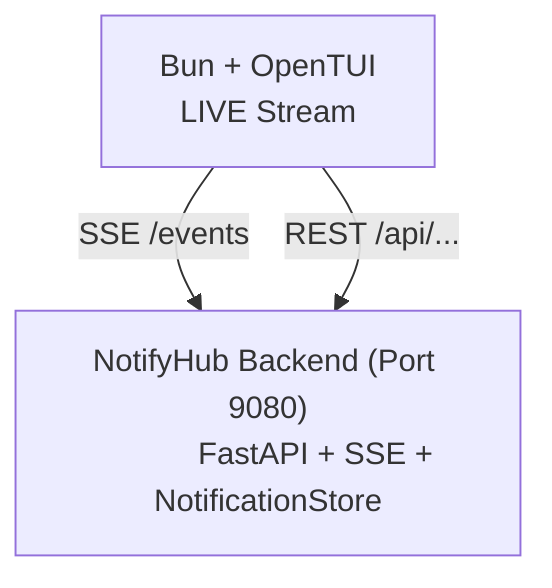

# NotifyHub TUI

> Terminal User Interface for NotifyHub — a real-time notification client in your terminal.

## Overview

The TUI is a full-screen terminal application that connects to the NotifyHub backend to display, browse, and manage notifications in real time. Built with [OpenTUI](https://opentui.dev) (React bindings) + Bun.

## Architecture



## Features

### 1. Live Notification Stream
The main view is a real-time scrolling feed of notifications received via SSE from the backend.
- Auto-scrolling feed (sticks to bottom)
- Receives `init` snapshot on connect, then live `notification` events
- Keyboard navigation: `j`/`k` or `↑`/`↓` to select individual cards
- Delete selected notification: `Delete` or `Backspace`
- Viewport culling for performance with large lists

### 2. Notification Cards
Each notification is rendered as a bordered card (rounded corners) with:

```
╭──────────────────────────────────────╮
│V VoiceAI_ASR              09:30 AM  │  ← colored avatar + bold title + time
│ /home/lamnt45/git/VoiceAI_ASR       │  ← full pwd path (dimmed)
│ @USER ok, but i also want to the…   │  ← message with tag highlighting
╰──────────────────────────────────────╯
```

- **Colored avatar initial** — derived from a hash of the pwd path (15-color palette matching the web UI)
- **App name** — last segment of the pwd path, bold white
- **Timestamp** — formatted as `HH:MM AM/PM`
- **Full pwd path** — dimmed gray
- **Tag highlighting** — `[#tag:...]` rendered in gray, `[#truncated:...]` in dark gray
- **Selection** — highlighted border and background on the focused card

### 3. Status Popup
Press `s` to toggle a centered overlay showing:
- Connection status (`● Connected` / `○ Disconnected`) with host:port
- Total notification count
- SSE streaming status
- Dismisses on any key press

## Theme

High-contrast dark theme:

| Role | Color |
|------|-------|
| Page background | `#0a0a0a` |
| Card background | `#141414` |
| Card background (selected) | `#1e1e1e` |
| Card border | `#2a2a2a` |
| Card border (selected) | `#555555` |
| Title text | `#ffffff` bold |
| Body text | `#d4d4d4` |
| Dimmed text | `#888888` |
| Timestamp | `#999999` |
| Footer background | `#0d0d0d` |
| Popup background | `#111111` |

## Keyboard Shortcuts

| Key | Action |
|-----|--------|
| `j` / `k` or `↑` / `↓` | Navigate notification list |
| `Delete` / `Backspace` | Delete selected notification |
| `s` | Toggle status popup |
| `q` | Quit the TUI |
| `Ctrl+C` | Quit (handled by renderer) |

## Project Structure

```
src/notifyhub/tui/
├── package.json              # Bun deps: @opentui/core, @opentui/react, react 19
├── tsconfig.json             # TypeScript + JSX config
├── src/
│   ├── index.tsx             # Entry point — creates CliRenderer, mounts App
│   ├── App.tsx               # Main layout, keyboard nav, popup management
│   ├── types.ts              # NotificationItem, ServerInfo types
│   ├── utils/
│   │   └── api.ts            # REST API client + SSE connection (manual parser)
│   ├── hooks/
│   │   └── useNotifications.ts  # SSE subscription + notification state mgmt
│   └── components/
│       ├── NotificationStream.tsx   # Live auto-scrolling feed with nav
│       ├── NotificationRow.tsx      # Notification card renderer
│       └── StatusPopup.tsx          # Centered status overlay
```

## API Integration

### SSE Endpoint (`/events`)
The TUI connects to the SSE stream using the Fetch API + ReadableStream reader:
1. Sends `GET /events`
2. Parses SSE protocol manually (`event:` and `data:` fields with CRLF line endings)
3. Handles events: `init`, `notification`, `delete`, `clear`, `heartbeat`, `shutdown`

### REST Endpoints
- `GET /api/notifications` — Fetch all notifications (used on connect and periodic refresh)
- `DELETE /api/notifications?id=xxx` — Delete a single notification

## Commands

```bash
# Install dependencies (after cloning)
make tui-deps
# Equivalent: cd src/notifyhub/tui && bun install

# Run the TUI (backend must be running on :9080)
make tui
# Equivalent: cd src/notifyhub/tui && bun src/index.tsx
```

## Configuration

The TUI connects to `localhost:9080` by default. To change the backend address, update the default constants in `src/notifyhub/tui/src/utils/api.ts`.
